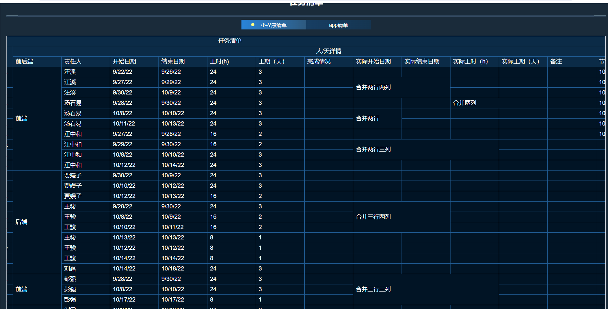

# table-merge

## 将 excel 数据转换为 elment table 能够加载的数据，同时实现表格的行列合并操作

- 大致效果如下

1、行列合并效果


2、sheet 切换效果


## Project setup

```
yarn install
```

### Compiles and hot-reloads for development

```
yarn serve
```

### Compiles and minifies for production

```
yarn build
```

### Lints and fixes files

```
yarn lint
```

### Customize configuration

See [Configuration Reference](https://cli.vuejs.org/config/).
